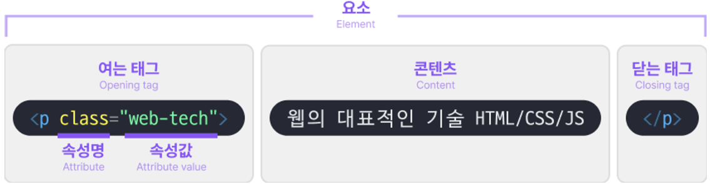
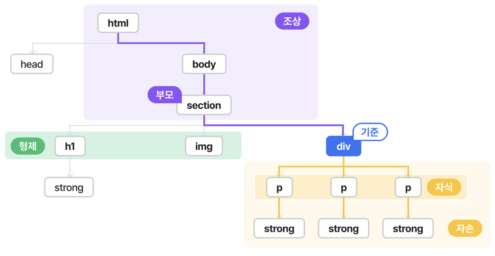

# **HTML 기본**
HTML은 요소(Elements)로 구성되어 있습니다.


## **1. 요소(Elements)**



### **태그(Tag)**
*어떤 표시를 하기위해 붙인 꼬리표
*웹 문서에 정보를 정의해주는 형식
    * 시작 태그(여는 태그) : <>
    * 종료 태그(닫는 태그) : <\\>

*시작 태그(<>) 안에는 속성(class)정보가 입력된다.


*태그의 예시
    * 올바른 예시 : 
        <p>
        HTML은 요소 안에
        <strong>다른 요소</strong>가 들어갈 수 있습니다.
        </p>
    ```html
        <!-- 올바른 예시 -->
        <p>
            HTML은 요소 안에
            <strong>다른 요소</strong>가 들어갈 수 있습니다.
        </p>
    ```

    * 틀린 예시 : 
        <p>
            HTML은 중간에 안에
            <strong>다른 요소가 들어갈 수 있습니다.
        </p>
            </strong>
    ```html   
        <!-- 틀린 예시 1 : 박싱 설정이 잘 못 된 경우-->
        <p>
            HTML은 중간에 안에
            <strong>다른 요소가 들어갈 수 있습니다.
        </p>
            </strong>
    ```
    
    ```html   
        <!-- 틀린 예시 2 : 닫는 태그가 없는 경우 -->
        <p>
            HTML은 중간에 안에
            <strong>다른 요소가 들어갈 수 있습니다.
        </p>
    ```


> html은 오류를 알려주지 않고, 웹브라우저가 임의로 결과를 보여줍니다.
> 마크업(Markup) 검사를 통해 오류를 확인하는 습관을 가져야 합니다.
[Markup Validation Service](https://validator.w3.org/)

### **주석**
*프로그램 동작에 영향을 미치지 않습니다.
*중요한 기밀 사항을 적어놓는 것을 피해야합니다.
*필요한 설명을 작성할 때 활용합니다.

*단축키 : (윈도우) ctrl + / (Mac) cmd + /

*예시
 1. 태그의 시작과 끝
    ```html
        <!-- 00메뉴 관련  -->
    ```
 2. 협업할 때 필요한 정보 작성
    ```html
        <!-- 20xx.xx.xx. 00:00 업데이트 / 코드 수정자 : 000  -->
    ```
 3. 임시 처리
    ```html
        <!-- 아래의 코드를 사용하지 않을 때 임시처리  -->
    ```

### **요소간 관계(Relationship)**


    ```html
    <html>

    <head></head>

    <body>
    <section>
        <h1>
            <strong></strong>
        </h1>
        
        <div>
            <p>
                <strong></strong>
            </p>
        </div>
        <div>
            <p>
                <strong></strong>
            </p>
        </div>
    </section>
    </body>

    </html>
    ```


## **2. HTML 문서 구조**

```html
<!DOCTYPE html>
<html lang="en">
<head>
  <meta charset="UTF-8">
  <meta http-equiv="X-UA-Compatible" content="IE=edge">
  <meta name="viewport" content="width=device-width, initial-scale=1.0">
  <title>Document</title>
</head>
<body>
  
</body>
</html>
```


### 가. **<!DOCTYPE html>**
 *이 문서는 **html Living Stadard 문서** 라는 의미입니다.
 *DTD(Document Type Definition)라고도 부르며, 문서의 타입에 대한 정보를 제공합니다. 해당 코드를 통해 어떤 모드로 페이지를 생성할지 결정합니다.

 ### 나. **<html lang="en">**
 * <html> 태그는 문서의 근간으로 제일 윗부분에 위치합니다. 
 * 해당 내용 안에 모든 태그가 작성되어야 합니다.
 *lang 속성을 통해 주 언어가 무엇인지 설정할 수 있습니다.
    * 언어코드(소문자)-국가코드(대문자) 형태로 작성합니다.
    * en : 영어 , ko : 한국어 , ko-KR : 대한민국, ko-KP : 북한
    * 주 언어 설정은 검색엔진, 스크린리더, 번역 등과 관련있습니다.

    
 ### 다. **head**
 
 #### 다-1. **<meta>**
 #### 다-2. **<title>**
 #### 다-3. **<link>>**


 ### 라. **body**